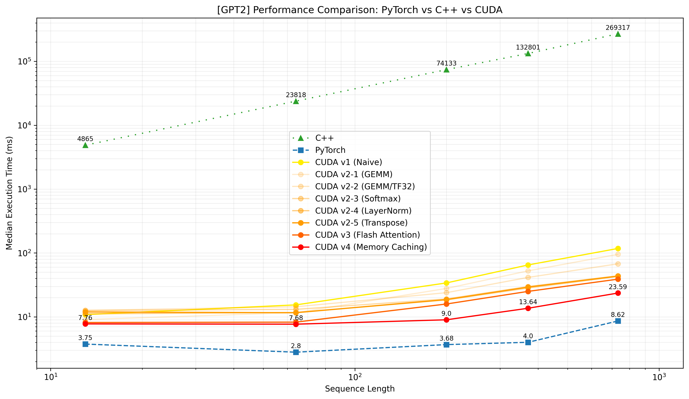
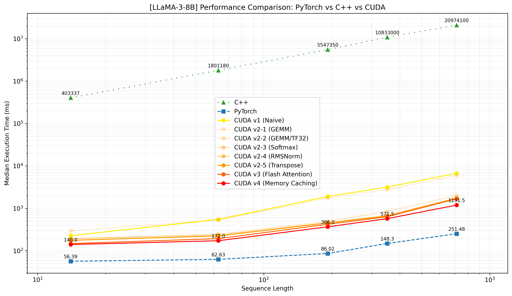

# Transformer with CUDA

Exploring Parallelization Techniques in Transformer Architecture


## About the Project



*Figure 1. Performance Comparison Results for GPT2*



*Figure 2. Performance Comparison Results for LLaMA-3-8B*

Although the transformer architectures have become the foundation of modern large language models, their development and deployment are still constrained by significant computational demands. Fortunately, with the remarkable advancements in both hardware and software design of parallelism—particularly graphics processing units (GPUs)—the processing speed of these workloads has been greatly accelerated. However, the underlying parallelization techniques are often abstracted away by high-level libraries, leaving them obscure to many researchers and developers. Therefore, this project aims to look deeper into the high-performance computing principles that have made today’s massive model architectures computationally feasible.

The objective is to implement a decoder-only transformer model (i.e., GPT2, LLaMA-3-8B) from scratch. Starting with a naive C++ CPU-based implementation of the model, the project bridges the performance gap by migrating the model’s entire inference workload from the CPU to the GPU. During the optimization process, all acceleration is achieved through raw CUDA C++ kernels, strictly avoiding off-the-shelf NVIDIA CUDA libraries such as cuBLAS or cuDNN.

More details can be found in the [report](./docs/Project%20Report.pdf).

### PyTorch (Upper Bound)

The PyTorch implementation is used to export model weights and generate validation datasets (inputs and expected outputs) to verify the correctness of the C++ and CUDA versions. To ensure a competitive baseline, the model runs with TensorFloat-32 (TF32) precision enabled and utilizes torch.compile to leverage kernel fusion and optimization. 

### C++ (Lower Bound, Baseline)

The C++ implementation is a naive, single-threaded CPU execution of the model architecture. It serves as the lower bound baseline and an architecture template, which is ported to the CUDA implementation.

### CUDA

The core of the project involves four distinct versions of the CUDA implementation, evolving from a direct port from C++ to a highly optimized inference engine. The final version concluded with 99% performance gain over the C++ baseline, 2.7 times slower than the PyTorch upper bound. The sections below elaborate the accelerations for each version.

#### Version 1 (Naive)

The first version is a direct translation of the C++ logic to CUDA. The transformer architecture is decomposed into fundamental kernels: embed, transpose, matmul, add, add_bias, gelu, layer_norm, and softmax. Each kernel is implemented naively, relying on standard global memory accesses without architectural optimization.

#### Version 2 (Kernel Optimizations)

This version introduces specific optimizations across five incremental stages (v2-1 to v2-5).

 - Matrix Multiplication (GEMM): The naive matrix multiplication is first upgraded to use shared memory tiling (v2-1). It is then further accelerated using Tensor Cores with TF32 precision (v2-2). To match the Tensor Core hardware instruction shape (16 x 16 x 8), shared memory tiles are adjusted to 32 x 16 and 16 x 32, with blocks launched across four warps.
 - Reductions (Softmax & LayerNorm): Both operations (v2-3, v2-4) are optimized using the online softmax algorithm combined with warp-level parallel reduction. To minimize synchronization overhead (__syncthreads), each warp first reduces to a single value stored in shared memory, which is then aggregated by the thread 0 of the block.
 - Coalesced Memory Access: The transpose kernel (v2-5) is optimized to ensure coalesced global memory access via shared memory tiling.

#### Version 3 (Flash Attention)

The kernel is based on the FlashAttention-2 algorithm, which addresses the memory bandwidth bottleneck of the attention mechanism. It is designed such that each thread block processes a specific query block and an attention head. Within the block, warps are assigned to process individual rows of the query, and it keeps the query in the registers while streaming keys and values through shared memory.

```cpp
dim3 block_dims(32, QUERY_BLOCK_SIZE);
dim3 grid_dims(num_heads, 1 + (seq_len - 1) / QUERY_BLOCK_SIZE);
```

#### Version 4 (Memory Caching)

To mitigate the latency overhead of dynamic memory management, this version implements a static memory pool strategy similar to PyTorch’s caching allocator. Instead of repeatedly calling cudaMalloc and cudaFree for temporary matrices during every layer of inference, the system allocates a single set of buffers at the start of the forward pass and reuses them across all transformer layers.


## Running the Code

The environmental configurations are done on top of [Miniconda](https://www.anaconda.com/docs/getting-started/miniconda/install).

```sh
# Use an appropriate version for your machine, channel pinned to avoid loose dependencies
conda create -n cuda --override-channels \
    -c nvidia/label/cuda-12.1.0 -c pytorch -c conda-forge \
    pytorch pytorch-cuda=12.1 cuda-toolkit gxx_linux-64
```

```sh
conda activate cuda
pip3 install numpy transformers
```

Before running LLaMA models for C++/CUDA, download the weights with Python scripts.

### Python

```sh
sbatch --job-name=gpt2 python/main.sh --model_name gpt2
sbatch --job-name=gpt2 python/timer.sh --model_name gpt2
```

```sh
sbatch --job-name=meta-llama/Meta-Llama-3-8B python/main.sh --model_name meta-llama/Meta-Llama-3-8B
sbatch --job-name=meta-llama/Meta-Llama-3-8B python/timer.sh --model_name meta-llama/Meta-Llama-3-8B
```

### C++

```sh
sbatch --job-name=gpt2 cpp/main.sh --model_name gpt2
sbatch --job-name=gpt2 cpp/timer.sh --model_name gpt2
```

```sh
sbatch --job-name=meta-llama/Meta-Llama-3-8B cpp/main.sh meta-llama/Meta-Llama-3-8B
sbatch --job-name=meta-llama/Meta-Llama-3-8B cpp/timer.sh meta-llama/Meta-Llama-3-8B
```

### CUDA

```sh
sbatch --job-name=gpt2 cuda/main.sh --model_name gpt2
sbatch --job-name=gpt2 cuda/timer.sh --model_name gpt2
```

```sh
sbatch --job-name=meta-llama/Meta-Llama-3-8B cuda/main.sh meta-llama/Meta-Llama-3-8B
sbatch --job-name=meta-llama/Meta-Llama-3-8B cuda/timer.sh meta-llama/Meta-Llama-3-8B
```
